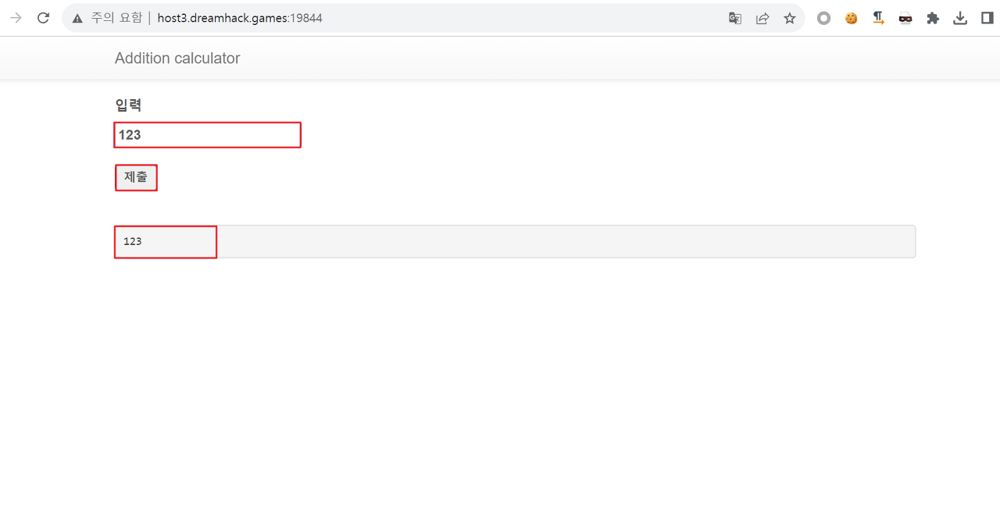
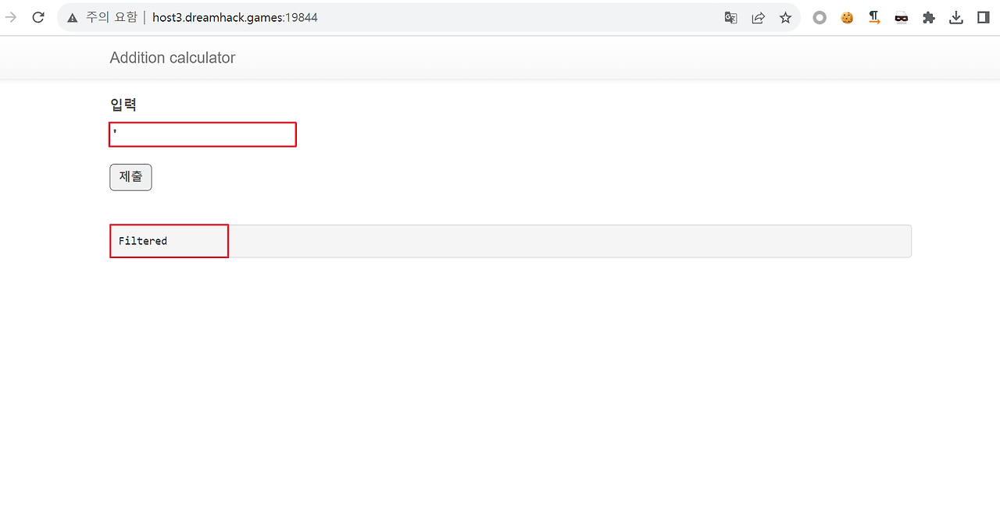
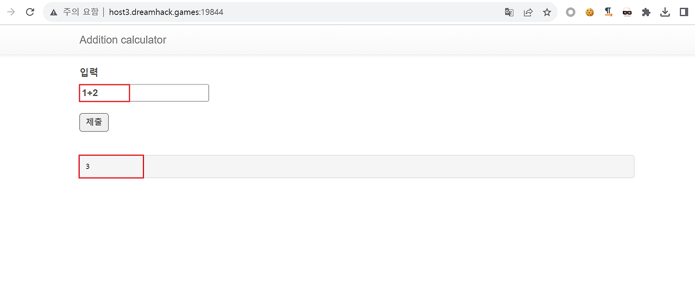
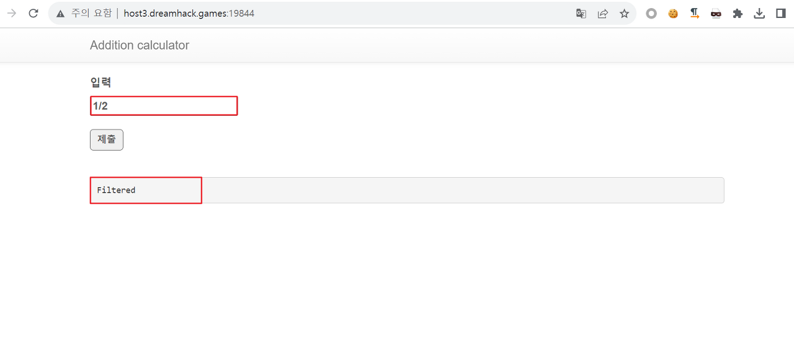
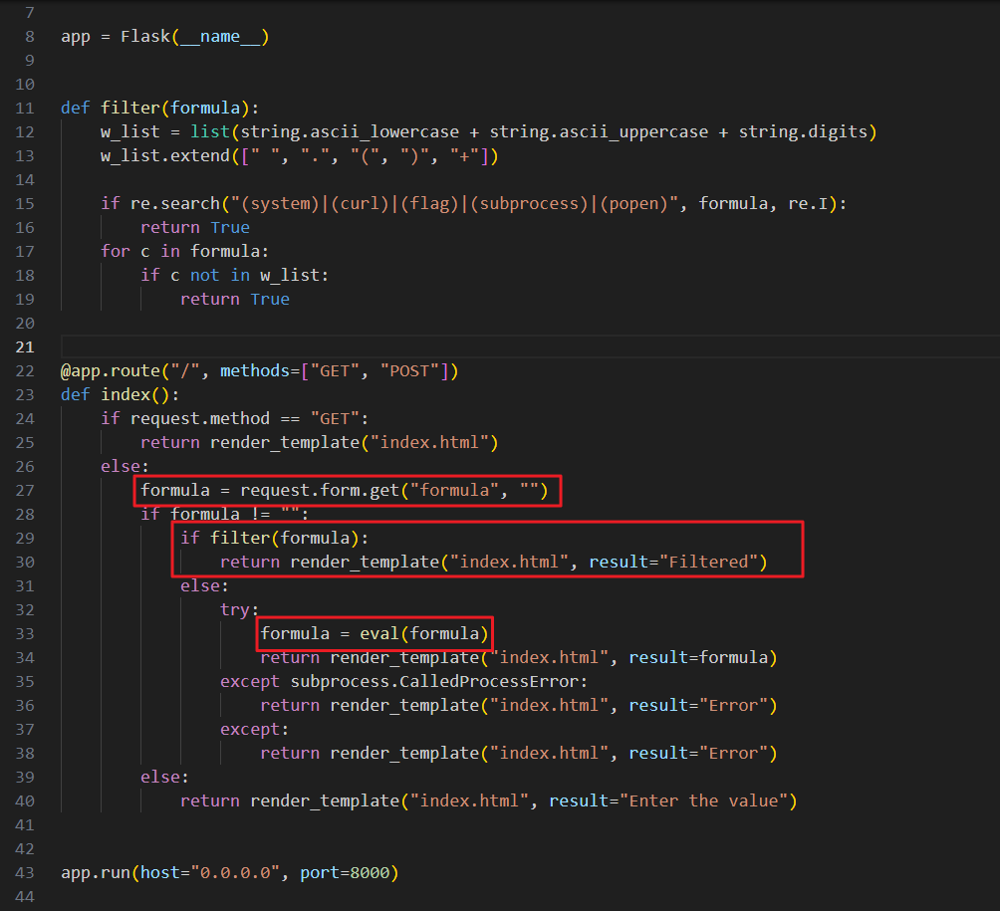

<h1>1. 웹페이지 접속</h1>

웹페이지에 접속하니 입력이 가능한 텍스트 필드와 제출 버튼이 존재하였으며 임의의 텍스트 입력 후 제출 버튼을 클릭하니 아래에 입력한 값이 출력되었다.



 


특별한 기능이 없는 것 같아 여러 값을 입력해보니 ' 을 입력하였을 때 Filtered 라는 문자열이 출력되는 것으로 보아  '(싱글쿼터)는 필터링되어있는 것을 알 수 있다.


 


그리고 1+2 를 입력하였더니 연산의 결괏값인 3을 출력하였다.

 

 

 

1 * 2, 1 / 2 등의 추가적인 수식을 입력해보았으나 Filtered 문자열이 출력되며 필터링되어있는 것을 알 수 있다. 

 

 

1 + 2 를 입력하였을 때는 단순히 입력한 수식의 연산 결괏값을 출력하는 웹페이지로 보였으나 곱셈 연산자, 나눗셈 연산자는 필터링되어있어 연산 결괏값이 출력되지 않았다. 단순히 계산한 결괏값을 출력하는 웹페이지는 아닌 것으로 보여 어떤 방식으로 동작하는지 알아내기 위해 주어진 소스코드를 분석하였다.

 

<h1>2. 소스코드 분석</h1>



 

전체 소스코드를 보았을 때 Flask로 작성된 웹페이지임을 알 수 있다. 다른 엔드포인트는 존재하지 않으며 line 27 코드를 보면 formula 파라미터로 사용자의 입력값을 받아 formula 변수에 저장하며 line 29 ~ 30 코드를 보면 filter 함수를 통해  formula 변수에 저장된 값을 검증하고 fiter 함수의 반환값이 True라면 Filtered 문자열을 출력하도록 되어있다.

 

line 33 코드를 보면 위에서 입력하였던 수식의 연산 결괏값이 나온 이유를 알 수 있는데 formula 변수의 값을 인자로 하여 eval 함수를 실행시킨다. 하지만 * 와 / 특수문자는 필터링되어 Filtered 문자열이 출력된 것이다.

 

웹페이지에 특별한 기능은 없었지만 eval 함수를 사용한다는 점에서 취약점이 발생할 수 있다고 판단하였고, eval 함수의 인자인 formula 변수 값은 filter 함수로 검증 과정을 거치게 되기 때문에 filter 함수의 검증 로직에 취약한 부분이 있다면 우회가 가능할 것이라 생각하여 어떤 문자를 필터링하는지 정확히 알기 위하여 해당 함수를 분석하였다.

 

 

```
def filter(formula):
    w_list = list(string.ascii_lowercase + string.ascii_uppercase + string.digits)
    w_list.extend([" ", ".", "(", ")", "+"])

    if re.search("(system)|(curl)|(flag)|(subprocess)|(popen)", formula, re.I):
        return True
    for c in formula:
        if c not in w_list:
            return True
 ```

 

filter 함수의 코드를 보면 알파벳의 대문자, 소문자, 숫자, 그리고 " "(공백), . , ( , ) , + 특수문자를 가지고 리스트를 만든다. 그리고 system, curl, flag, subprocess, popen 문자열이 존재할 때 True를 반환하며 함수의 인자로 받은 문자열을 for 반복문을 사용하여 만들었던 w_list 와 비교하고 w_list와 일치하는 문자열이 없다면 True를 반환한다.

 

filter 함수에서는 특정 문자가 함수의 인자로 받은 문자열에 존재하지 않는다면 True를 반환하며 이 함수에서 True가 반환되면 이 웹페이지에서는 Filtered 문자열이 출력된다. 이 방식은 정해진 문자 이외에는 입력될 수 없도록 필터링하는 화이트리스트 필터링 방식이며 따라서 우리가 formula 변수에 입력할 수 있는 문자는 알파벳 대, 소문자 그리고  " "(공백), . , ( , ) , + 특수문자이다.

 

이 문제에서 주어진 파일을 확인하였을 때 flag.txt 파일이 존재하였으므로 flag.txt 파일의 내용을 알아내야 하는 문제인 것 같았지만 flag 문자열은 필터링되어있어 입력할 수 없었다. 여러 방법을 고민한 결과 다음의 방법으로 공격을 실행하였다.

 

<h1>3. 공격 시나리오</h1>
1)  입력값에 파이썬 함수를 포함한 내용을 입력

 

2) 1 의 과정을 통해 flag 문자열 필터링을 우회하고 flag.txt 파일을 실행시킨 후 실행시킨 파일의 내용을 출력

 

 

<h1>4. 공격 과정</h1>
 

flag 문자열은 필터링되어 입력할 수 없었지만 chr(ascii_num) 을 입력값으로 주면 입력값을 인자로 하여 eval 함수를 실행하기 때문에 chr() 함수가 실행된다. chr() 함수는 문자를 반환하므로 이를 이용하여 flag 문자열 필터링을 우회할 수 있다.

 

다음의 값을 입력하였을 때 eval 함수에서 입력한 값을 인자로 하여 chr 함수가 실행되어 flag 문자열이 출력되는 것을 확인할 수 있다.

 


chr(102)+chr(108)+chr(97)+chr(103)
 

 

웹페이지 접속 (1)
공격 과정 (1)
 

다음은 flag.txt 파일을 실행시켜 내용을 출력하기 위하여 다음의 값을 입력하였다.

 


# open(flag.txt).readlines()

open(chr(102)+chr(108)+chr(97)+chr(103)+chr(46)+chr(116)+chr(120)+chr(116)).readlines()
 

다음의 값을 입력하면 eval 함수를 통해 open(flag.txt).readlines() 코드가 실행되며 flag.txt 파일의 내용을 출력하게 되어 flag를 획득할 수 있다.

 

웹페이지 접속 (1)
공격 과정 (2)
