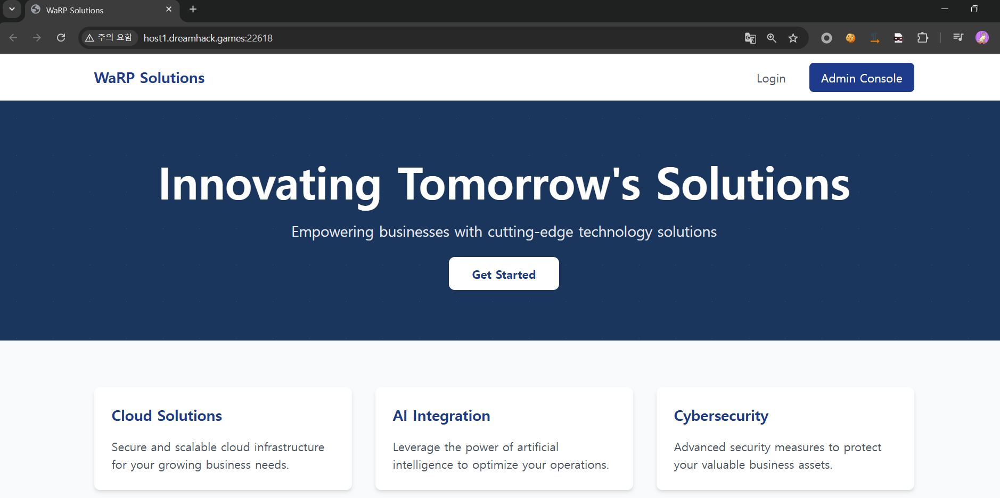
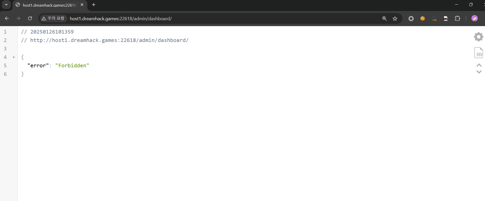
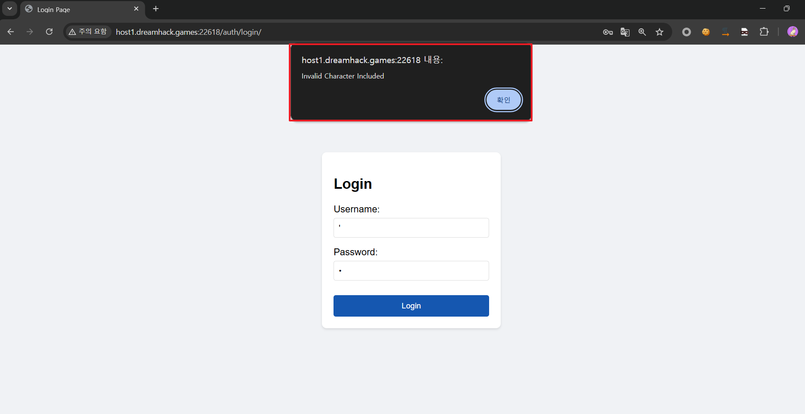
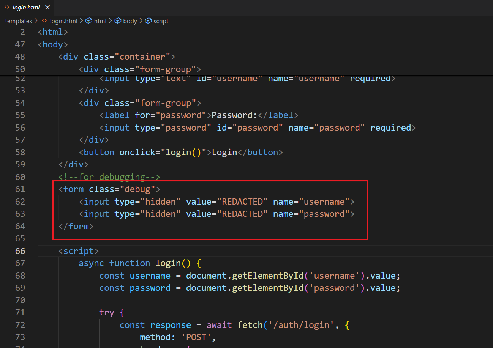
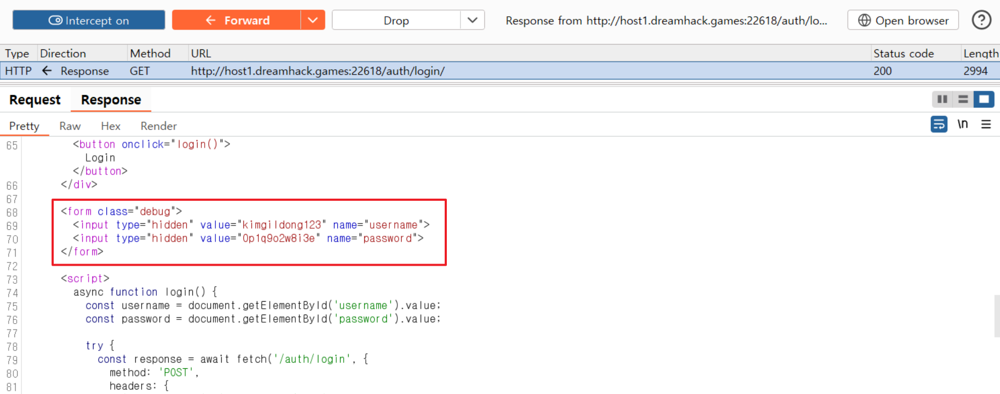
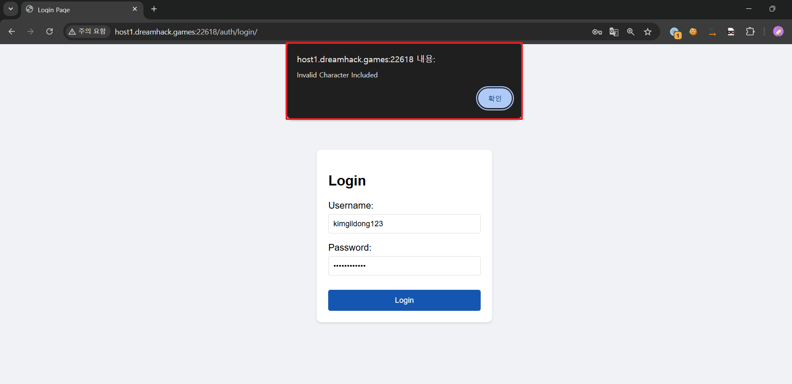
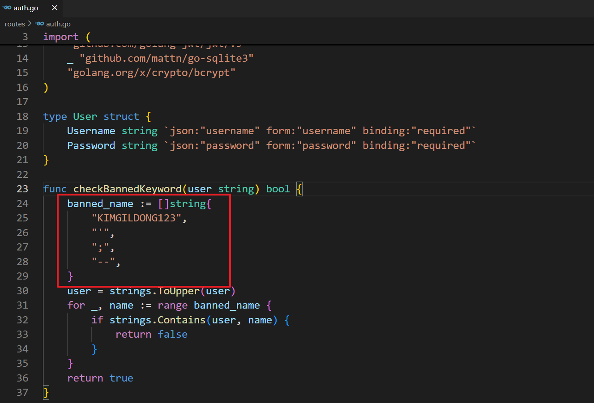
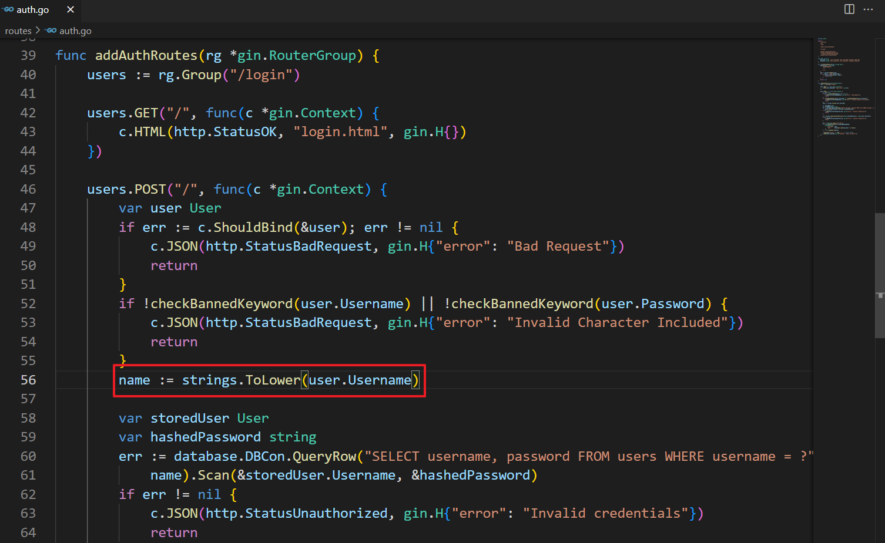
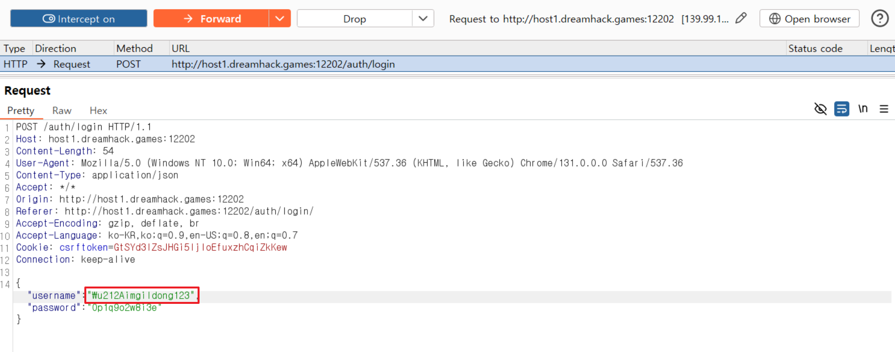
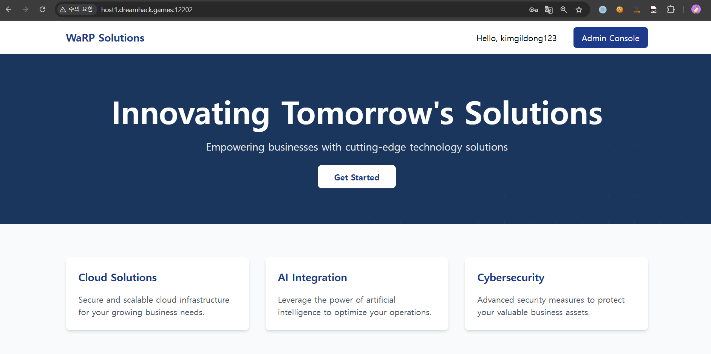

# 1. 웹페이지

웹페이지에 접속해보면 오른쪽 상단에 로그인 기능과 Admin Console 기능이 있는 것을 알 수 있다.

Admin Console 버튼을 클릭해보면, 접근이 금지되어 있는 것을 확인할 수 있다.

로그인 기능이 존재하지만 계정이 존재하지 않고, 회원가입이 불가능하여 로그인은 불가하였다. 또한, 에러 메시지를 통해 특수문자 필터링이 존재하는 것을 확인하였다.

# 2. 취약점 분석

login.html 소스코드를 분석해보면, 소스코드 내에 ID와 패스워드가 하드코딩 되어있는 것을 알 수 있다. 하지만 제공된 소스코드에서는 감춰져 있으므로 웹페이지에 접근하여 ID와 패스워드를 확인하였다.

알아낸 ID와 패스워드를 사용하여 로그인을 시도하였지만 로그인에 실패하였다.

소스코드를 확인해보니 하드코딩된 계정으로 로그인이 불가하도록 필터링 로직이 구현되어있었다.

필터링을 우회하기 위해 방법을 조사한 결과, 다음의 내용을 인터넷에서 찾을 수 있었다.

https://gosecure.github.io/presentations/2020_02_28_confoo/unicode_vulnerabilities_that_could_bite_you.pdf

인증을 처리하는 부분의 소스코드를 좀 더 살펴보면 ID와 패스워드를 입력받고, 필터링을 통과하면 ID 값을 인자로 하여 ToLower() 함수를 호출하고, 그 값을 사용하여 DB에서 계정을 조회한다.

그런데 대문자 K가 아니면서 ToLower() 함수를 거치면 소문자 k로 변환되는 문자가 존재한다. 그 문자는 켈빈 기호(KELVIN SIGN)이다.

checkBannedKeyword 함수와 인증을 처리하는 부분을 같이 살펴보면, 먼저 checkBannedKeyword 함수의 인자인 user 값을 ToUpper 함수를 사용하여 대문자로 변환하여 검증하고, 인증을 처리하는 부분에서는 이 함수를 거친 후 ID 값을 ToLower 함수를 사용하여 소문자로 변환한 후 DB에서 조회한다.

따라서 우리가 알아낸 ID인 kimgildong123 중 k 값을 켈빈 기호로 바꿔주면 ToUpper 함수를 거쳐도 KIMGILDONG123 이 아니게 되어 필터링 로직을 우회할 수 있게 되고, ToLower 함수를 거치면 kimgildong123이 되어 이 값을 사용하여 DB에서 조회하므로 필터링을 우회하고 알아낸 계정 정보로 로그인이 가능한 것이다.

계정 정보를 다음과 같이 주어 로그인을 시도하였다.

'''
ID : \u212Aimgildong123
PW : 0p1q9o2w8i3e
'''

로그인에 성공하였으며 다시 Admin Console에 접근을 시도하였다.

