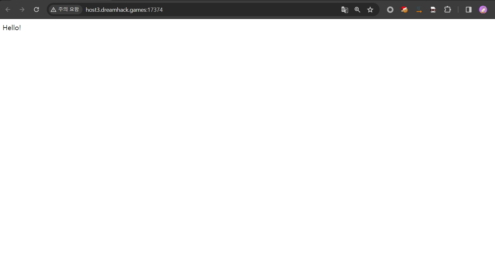
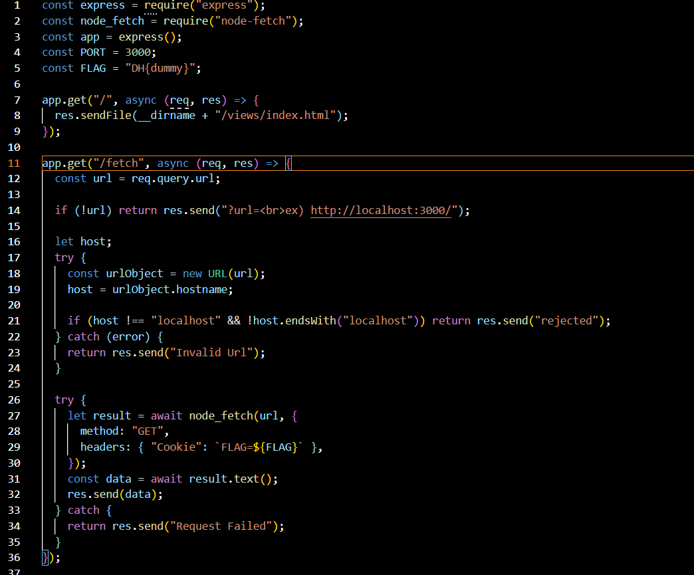
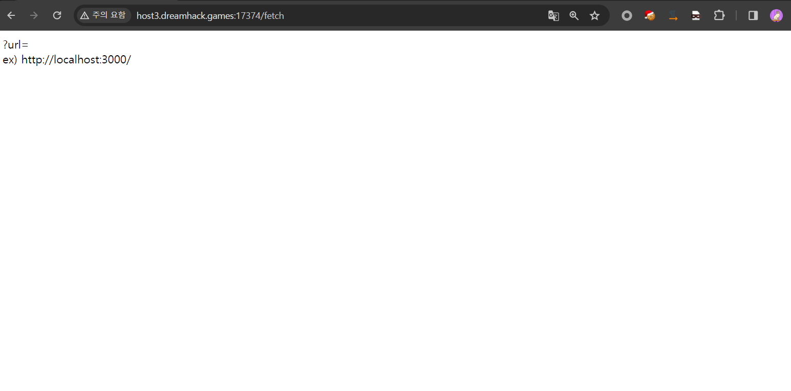

# 1. 웹페이지

해당 문제의 웹페이지에 접속 시 Hello 라는 문자열이 출력되고 이외의 기능은 보이지 않아 바로 소스코드를 보고 문제를 풀기로 하였다.



# 2. 소스코드 분석



소스코드를 보니 메인 페이지 이외에 /fetch 엔드포인트가 있는 것을 확인하였다. 자세한 기능을 분석하기 이전에 간단히 살펴보면 요청 시 url 파라미터를 통해 입력값을 받는 것을 확인할 수 있다.



출력결과를 보니 다시 메인 페이지가 출력된다. 우리가 url 파라미터에 입력한 값이 어떻게 이용되는지 알아보기 위해 /fetch 엔드포인트의 소스코드를 상세히 분석하였다.

```javascript
1 app.get("/fetch", async (req, res) => {
2  const url = req.query.url;
3
4  if (!url) return res.send("?url=<br>ex) http://localhost:3000/");
5
6  let host;
7  try {
8    const urlObject = new URL(url);
9    host = urlObject.hostname;
10
11    if (host !== "localhost" && !host.endsWith("localhost")) return res.send("rejected");
12  } catch (error) {
13    return res.send("Invalid Url");
14  }
15
16  try {
17    let result = await node_fetch(url, {
18      method: "GET",
19      headers: { "Cookie": `FLAG=${FLAG}` },
20    });
21    const data = await result.text();
22    res.send(data);
23  } catch {
24    return res.send("Request Failed");
25  }
```

먼저 url 파라미터에서 값을 받고, url 파라미터로 요청받는 값이 존재하지 않는다면 존재하지 않는다면 위에서 우리가 보았던 문자열을 출력한다.

그리고 line 8에서 url 파라미터에 값이 존재한다면 입력받은 값을 이용하여 URL 객체를 생성하고 urlObject 변수에 저장한다. 

line 9에서 host 변수에 urlObject.hostname을 저장한다. 

line 11~14 에서는 if (host !== "localhost" && !host.endsWith("localhost")) 코드를 통해 host 변수에 저장된 값을 검증한다. 만약 host 변수에 저장된 값이 "localhost" 이 아니고 host.endsWith("localhost") 가 false를 반환하면 "rejected" 를 반환한다. 그리고 위의 조건을 만족하지만 에러가 발생하였을 경우 Invalid Url 을 반환한다. 이는 우리가 입력한 url 의 hostname에 "localhost" 가 포함되어있는지를 검증하는 코드이다.

그리고 위의 조건문을 통과하면 line 16~25 에서 node-fetch를 이용해 우리가 url 파라미터에 입력한 url로 요청을 보내게 되는데 이때 쿠키 값에 플래그가 포함되어있다. 따라서 문제를 풀기 위해서는 쿠키 값을 알아내야한다.

# 3. 공격 방법

소스코드를 분석했을 때 이 문제를 풀기 위해 쿠키 값을 알아내야 하는데 이 웹페이지에 존재하는 기능을 이용하여 쿠키 값을 알아내기 위해서 다음과 같이 공격 과정을 계획하였다.

 

#### 1) /fetch 엔드포인트에서 url 입력 시 필터링을 우회하여 외부로 요청을 보내도록 하기

 

#### 2) Request Bin 을 통해 요청을 받아 쿠키값을 알아내기

 

먼저 url 파라미터에 값 입력 시 localhost 필터링을 우회하여야 하는데 검색해서 찾은 여러 우회 방법을 시도해본 결과 실패하였다. 계속 방법을 찾던 와중에  이 웹페이지가 Node.js로 작성되어있다는 점을 생각하고 Node.js에서 이와 관련된 취약점이 없었는지를 검색하였고, 이와 유사한 취약점에 대한 글을 찾을 수 있었다.

[link](https://toss.tech/article/nodejs-security-contribution)


